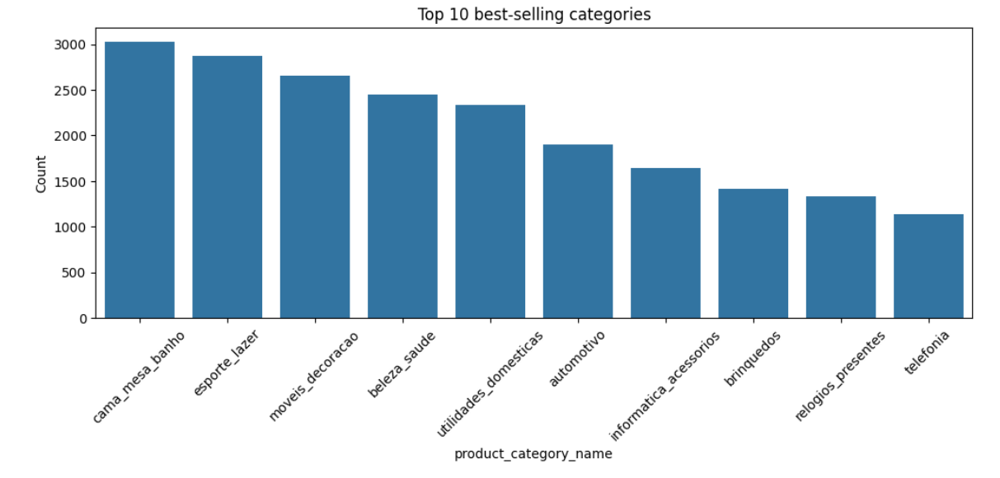
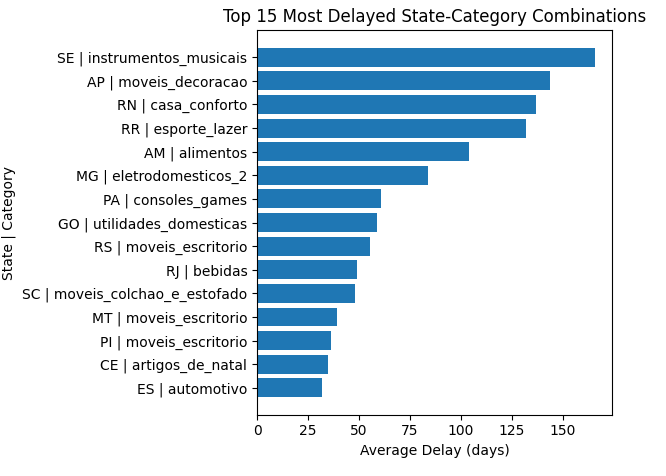
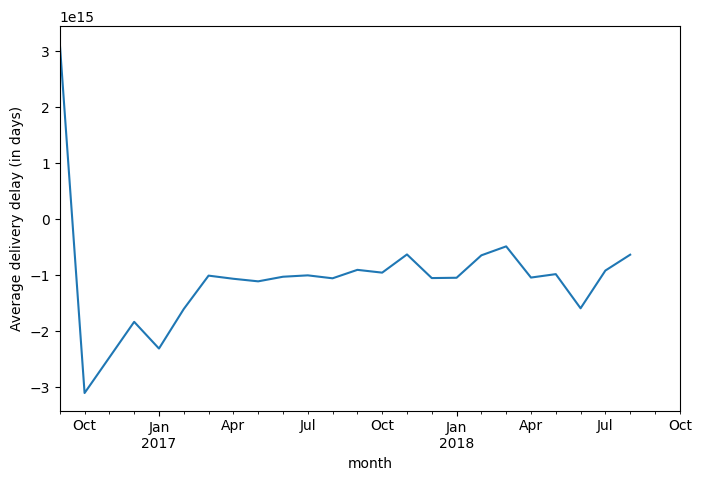
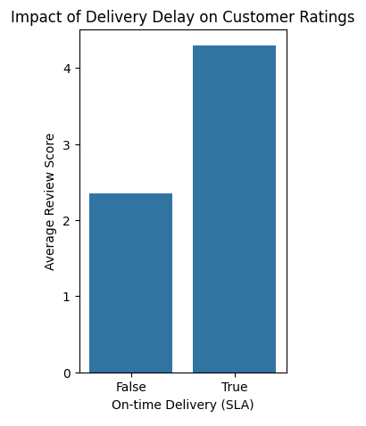

# 🛒 Olist SLA & Delivery Performance Analysis

## 📌 Overview

This project analyzes delivery performance and SLA (Service Level Agreement) compliance using the Olist E-commerce dataset.
The goal is to identify delays, evaluate logistics efficiency, and uncover patterns affecting customer satisfaction.

---

## 🎯 Business Problem

In e-commerce, delivery delays can significantly impact customer experience.
This project aims to:

* Measure delivery delays
* Evaluate SLA compliance
* Identify high-risk states and product categories

---

## 📂 Dataset

The dataset used is the **Olist E-commerce Dataset**, available on Kaggle.
It contains information about:

* Orders
* Customers
* Products
* Order items
* Delivery timestamps

---

## ❓ Key Questions

* Which states have the highest delivery delays?
* Which product categories are most associated with delays?
* How effectively is SLA being applied?
* What are the patterns behind late deliveries?

---

## 📑 Table of Contents

### **1. Data Preparation**

* Feature engineering

---

### **2. Data Overview**

* What is the total number of orders?
* Customers distribution in each city
* Total orders in each state
* Best-selling categories
* Are there categories that experience longer delivery times?
* What percentage of customers placed more than one order?
* How many orders have already been delivered?
* What is the average actual delivery time?

---

### **3. SLA Compliance**

* How many orders were delivered on time?
* How many orders were delayed beyond the SLA?
* What is the compliance rate with the SLA?
* What is the average number of delay days?
* What is the maximum delay observed?
* States with the most delivery delays
* Most delayed product in each state

---

### **4. Geographic Performance**

* Which states have the highest delay rates?
* Which states have the best delivery performance?

---

### **5. Delivery Time Analysis**

* Average actual delivery time vs estimated
* Distribution of delivery times
* Trend over time

---

### **6. Seller Impact**

* Top 10 sellers with delays (with at least 10 orders)
* Top 10 sellers with earliest delivery

---

### **7. Customer Satisfaction Impact**

* Does a delay affect customer ratings?

---

### **8. Root Cause Analysis**

* Filter data based on delayed orders only
* Represent time distribution
* Handle outliers and negative values
* Distance between customers and sellers
* Remove outliers

---

## 🛠️ Tools & Technologies

* Python
* Pandas
* NumPy
* Matplotlib / Seaborn
* Jupyter Notebook

---

## ⚙️ Data Processing

* Merged multiple datasets (orders, customers, items, products)
* Handled missing values
* Created new features:

  * `delay` (difference between actual and estimated delivery)
  * `apply_SLA` (whether SLA conditions are met)

---

## 📊 Key Insights

* Certain states show consistently higher delivery delays
* Specific product categories are more prone to late delivery
* SLA is not consistently respected across all orders
* Delay distribution reveals significant outliers

---

## 📈 Visualizations

Some of the key analysis results:

---

### 📊 Top 10 Best-Selling Categories


---

### 📍 Top Delayed States


---

### 📦 Top Delayed State-Category Combinations


---

### ⏱️ Categories with Longest Delivery Time


---

### 📉 Average Delivery Delay (Days)


---

### ⭐ Impact of Delay on Customer Ratings


---

## 💡 Recommendations

* Improve logistics in high-delay states
* Re-evaluate suppliers for problematic product categories
* Enhance SLA monitoring and enforcement
* Optimize shipping routes and fulfillment processes

---

## 📎 Project Structure

```
olist-sla-analysis/
│
├── notebooks/
│   └── sla_analysis.ipynb
│
├── images/
│
├── presentation/
│   └── sla_analysis.pptx
│
├── README.md
└── requirements.txt
```

---

## 📽️ Presentation

[View Presentation](#)  <!-- Replace with your link -->

---

## 🚀 Future Work

* Build a predictive model to forecast delivery delays
* Create an interactive dashboard (Power BI / Streamlit)
* Integrate real-time monitoring system

---

## 👤 Author

**Abdelrhman Khalil Abdullah**
